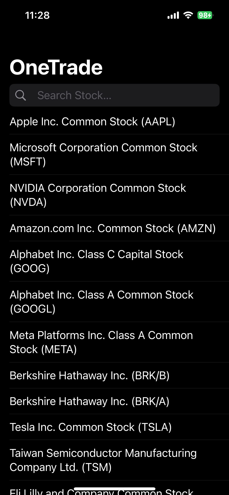
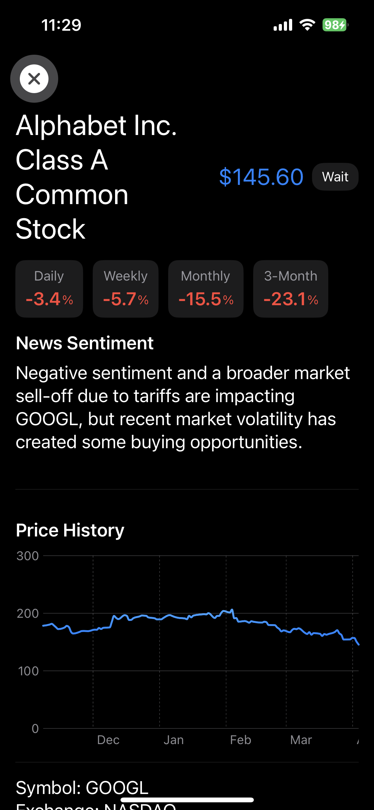
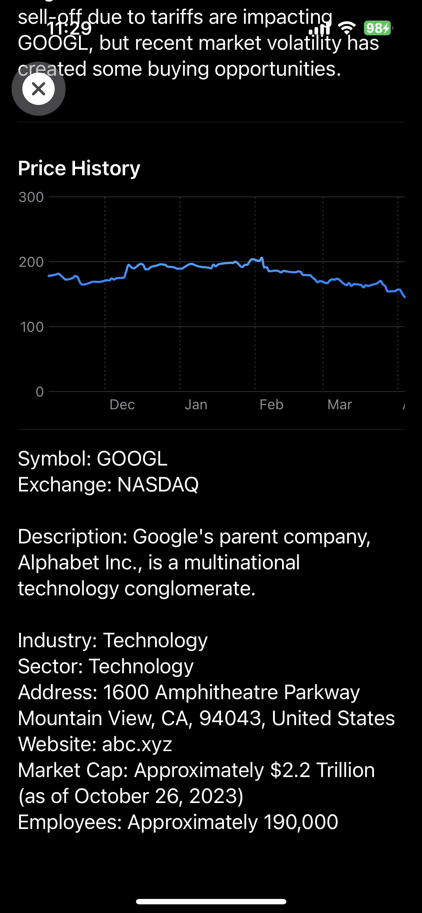

**Summary:**
OneTrade is an iOS app developed with the idea of being an all-in-one solution for buying stocks without any fluff. Analysing current market trends and common consensus on a given company, OneTrade provides the information needed to make an informed desicion when buying stocks.

**Language:**
- SwiftUI

**APIs:**
- Google Gemini - Used for AI summarys of news articles and fallback for company descriptions
- Polygon - Used to get company descriptions
- twelvedata - Used to obtain current stock values
- FinnHub - Used to get current news articles

**Credits:**
- NASDAQ and NYSE Symbols - https://github.com/rreichel3/US-Stock-Symbols/blob/main/
- Code Help - ChatGPT and Google Gemini

